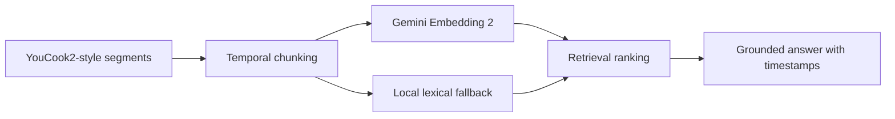

# video-rag-gemini-embeddings2

Este projeto mostra como estruturar um **RAG para videos instrucionais** com chunks temporais, metadados por trecho e uma rota preparada para **Gemini Embedding 2**.

A inspiracao principal aqui e o **YouCook2**, porque videos instrucionais sao um caso excelente para retrieval grounded com timestamps. Em vez de indexar um video inteiro como um unico documento, o pipeline trata cada passo como uma unidade recuperavel com:

- `video_id`
- `segment_id`
- `step_id`
- `start_time`
- `end_time`
- `instruction_text`
- `visual_description`

## O que o projeto faz

1. Gera um corpus `YouCook2-style` com segmentos de receita.
2. Trata cada trecho como um chunk temporal independente.
3. Usa `Gemini Embedding 2` quando o runtime esta habilitado.
4. Mantem um fallback local reproduzivel para semantic search aproximada.
5. Responde com grounding por trecho e intervalo de tempo.

## Por que `Gemini Embedding 2` importa aqui

O valor de `Gemini Embedding 2` nesse tipo de projeto esta em representar consultas e chunks de video em um espaco semantico mais robusto do que uma simples busca lexical. Isso e especialmente importante quando:

- a pergunta do usuario nao repete as mesmas palavras do passo;
- o trecho relevante depende de contexto visual e instrucional;
- a resposta precisa apontar exatamente **onde** no video a etapa aparece.

## Arquitetura



## Estrutura do repositorio

- [main.py](/Users/flaviagaia/Documents/CV_FLAVIA_CODEX/video-rag-gemini-embeddings2/main.py)  
  Entry point local.

- [app.py](/Users/flaviagaia/Documents/CV_FLAVIA_CODEX/video-rag-gemini-embeddings2/app.py)  
  API simples para busca.

- [src/sample_data.py](/Users/flaviagaia/Documents/CV_FLAVIA_CODEX/video-rag-gemini-embeddings2/src/sample_data.py)  
  Gera o corpus local `YouCook2-style`.

- [src/retrieval.py](/Users/flaviagaia/Documents/CV_FLAVIA_CODEX/video-rag-gemini-embeddings2/src/retrieval.py)  
  Implementa a engine de retrieval com dois modos: `gemini_embedding_2` e `local_tfidf_fallback`.

- [src/generation.py](/Users/flaviagaia/Documents/CV_FLAVIA_CODEX/video-rag-gemini-embeddings2/src/generation.py)  
  Construi a resposta grounded com timestamps e citacoes.

- [src/pipeline.py](/Users/flaviagaia/Documents/CV_FLAVIA_CODEX/video-rag-gemini-embeddings2/src/pipeline.py)  
  Orquestra a execucao ponta a ponta.

- [tests/test_project.py](/Users/flaviagaia/Documents/CV_FLAVIA_CODEX/video-rag-gemini-embeddings2/tests/test_project.py)  
  Garante o contrato minimo do pipeline.

## Runtime modes

### 1. `gemini_embedding_2`
Ativado quando `GEMINI_API_KEY` e o client `google.genai` estao disponiveis.

Nesse modo, o projeto usa:

- `model_name = "gemini-embedding-2-preview"`

### 2. `local_tfidf_fallback`
Quando o runtime do Gemini nao esta disponivel, o projeto usa um fallback lexical e deterministico, mantendo:

- execucao local;
- testes automatizados;
- reprodutibilidade do benchmark.

## Como executar

```bash
python3 main.py
```

Para rodar a API:

```bash
uvicorn app:app --reload
```

## Endpoints

- `GET /health`
- `POST /search`

## Resultado atual

- `dataset_source = youcook2_style_local_video_sample`
- `runtime_mode = local_tfidf_fallback`
- `segment_count = 6`
- `top_segment_id = VID-1002`
- `top_video_id = YC2-PASTA-01`
- `top_time_range = 00:19-00:36`
- `top_similarity = 0.4431`

## O que esse projeto demonstra

- chunking temporal de video;
- retrieval orientado a trecho;
- grounding com timestamps;
- arquitetura pronta para embeddings multimodais;
- handoff facil para um backend de producao.

## Leitura tecnica

O ponto principal deste projeto e mostrar que, em video RAG, o chunk correto normalmente nao e o video inteiro. O chunk correto tende a ser uma **janela temporal** ou um **passo instrucional**.

Isso melhora:

- recuperacao de trechos relevantes;
- explicabilidade;
- citacao com `start_time` e `end_time`;
- consumo por copilotos, assistentes de estudo ou motores de how-to search.

## English

This project shows how to structure an **instructional-video RAG system** with temporal chunks, per-segment metadata, and a production-oriented path prepared for **Gemini Embedding 2**.

The main inspiration is **YouCook2**, because instructional videos are a strong use case for grounded retrieval with timestamps. Instead of indexing a full video as a single document, the pipeline treats each step as a retrievable unit with:

- `video_id`
- `segment_id`
- `step_id`
- `start_time`
- `end_time`
- `instruction_text`
- `visual_description`

### What the project demonstrates

- temporal chunking for video retrieval
- grounded answers with timestamps
- a Gemini-ready embedding path
- a deterministic local fallback
- a simple API for engineering handoff
