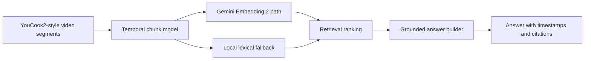

# video-rag-gemini-embeddings2

Este projeto mostra como estruturar um **RAG para videos instrucionais** usando chunks temporais, grounding com timestamps e uma rota preparada para **Gemini Embedding 2**.

Ele foi desenhado como um MVP que responde a uma pergunta muito prática:

**como encontrar exatamente o trecho certo de um video quando o usuario faz uma pergunta em linguagem natural?**

Em videos instrucionais, essa pergunta importa muito. O usuario raramente quer "o video inteiro". O que ele quer e algo como:

- "onde o cozinheiro mostra como preparar o molho?"
- "em que momento ele adiciona o tempero?"
- "qual trecho mostra o passo da mistura?"

Esse e exatamente o tipo de problema em que um pipeline de **video RAG** faz sentido.

## Storytelling basico

Imagine um catalogo de videos de receita, manutencao, treinamento ou onboarding. Se voce indexar cada video como se fosse um unico documento, a busca fica ruim porque:

- o video e longo demais;
- diferentes etapas ficam misturadas no mesmo item;
- a resposta nao consegue apontar o momento exato;
- o usuario recebe contexto demais e precisao de menos.

Entao a ideia deste projeto e simples:

1. quebrar o video em **trechos temporais significativos**;
2. tratar cada trecho como uma unidade de retrieval;
3. responder com **o passo certo e o intervalo certo**.

## Storytelling intermediario

O projeto foi inspirado no **YouCook2**, um dataset muito conhecido de videos instrucionais. Ele e especialmente bom para esse caso porque o conteudo naturalmente se organiza em:

- etapas;
- acoes;
- segmentos temporais;
- descricoes alinhadas ao que acontece no video.

Em vez de representar o video inteiro como um item so, este repositório modela cada trecho com:

- `video_id`
- `segment_id`
- `step_id`
- `start_time`
- `end_time`
- `instruction_text`
- `visual_description`

Esse desenho aproxima o pipeline de como um produto real de video search, learning assistant ou help assistant precisaria funcionar.

## Storytelling avancado

O principal trade-off arquitetural aqui e o seguinte:

- **indexar o video inteiro** e mais simples, mas perde granularidade;
- **indexar por trecho** aumenta o trabalho de ingestao, mas melhora muito a recuperacao e a explicabilidade.

Este projeto escolhe a segunda abordagem porque ela suporta melhor:

- grounding com timestamp;
- retrieval de passos;
- resposta com citacao objetiva;
- experiencia melhor para copilotos e assistentes.

Em um sistema de producao, esse desenho tambem favorece:

- reranking por trecho;
- montagem de playlists por resposta;
- highlight do momento exato no player;
- analytics sobre quais segmentos sao mais recuperados.

## Storytelling extremamente tecnico

O ponto central e que **video RAG** nao depende apenas do texto da pergunta, mas da forma como o video e discretizado em unidades semanticamente utilizaveis.

Aqui, cada trecho funciona como um **document chunk temporal**. Esse chunk agrega:

- referencia de origem (`video_id`);
- posicao no fluxo (`step_id`);
- localizacao temporal (`start_time`, `end_time`);
- semantica textual do passo (`instruction_text`);
- contexto descritivo mais visual (`visual_description`).

Com isso, o pipeline cria um indice no qual a unidade recuperavel nao e "o video", mas sim "o momento do video".

Isso e importante porque a qualidade de um sistema de retrieval em video depende fortemente de:

- granularidade do chunk;
- cobertura semantica do texto associado ao trecho;
- capacidade do embedding de capturar equivalencia de linguagem;
- capacidade de apontar uma evidência concreta no output final.

## O que o projeto faz

1. Gera um corpus local `YouCook2-style`.
2. Representa cada passo de receita como chunk temporal.
3. Tenta usar `Gemini Embedding 2` como rota principal.
4. Se o runtime nao estiver disponivel, usa um fallback local deterministico.
5. Retorna uma resposta grounded com:
   - trecho vencedor
   - `video_id`
   - `segment_id`
   - intervalo de tempo
   - citacoes dos top resultados

## Por que `Gemini Embedding 2` importa aqui

`Gemini Embedding 2` faz muito sentido nesse projeto porque o objetivo nao e encontrar apenas trechos com a mesma palavra-chave. O objetivo e recuperar o passo certo mesmo quando a pergunta muda de vocabulário.

Por exemplo:

- o trecho fala em `melt butter`
- o usuario pergunta `prepare the sauce base`

Uma busca puramente lexical tende a sofrer mais com esse tipo de variação. Um embedding forte ajuda a aproximar consulta e trecho pelo significado, nao apenas pela sobreposição literal de termos.

Neste projeto, a rota principal preparada e:

- `model_name = "gemini-embedding-2-preview"`

## Arquitetura



## Estrutura do repositorio

- [main.py](/Users/flaviagaia/Documents/CV_FLAVIA_CODEX/video-rag-gemini-embeddings2/main.py)  
  Entry point local para executar o pipeline ponta a ponta.

- [app.py](/Users/flaviagaia/Documents/CV_FLAVIA_CODEX/video-rag-gemini-embeddings2/app.py)  
  API simples para handoff com engenharia e integracao com backend.

- [src/sample_data.py](/Users/flaviagaia/Documents/CV_FLAVIA_CODEX/video-rag-gemini-embeddings2/src/sample_data.py)  
  Gera o corpus local `YouCook2-style` com segmentos instrucionais.

- [src/retrieval.py](/Users/flaviagaia/Documents/CV_FLAVIA_CODEX/video-rag-gemini-embeddings2/src/retrieval.py)  
  Implementa a engine de retrieval com dois runtimes:
  `gemini_embedding_2` e `local_tfidf_fallback`.

- [src/generation.py](/Users/flaviagaia/Documents/CV_FLAVIA_CODEX/video-rag-gemini-embeddings2/src/generation.py)  
  Constrói a resposta final grounded com timestamps e citacoes.

- [src/pipeline.py](/Users/flaviagaia/Documents/CV_FLAVIA_CODEX/video-rag-gemini-embeddings2/src/pipeline.py)  
  Orquestra dataset, retrieval, grounding e artefato final.

- [tests/test_project.py](/Users/flaviagaia/Documents/CV_FLAVIA_CODEX/video-rag-gemini-embeddings2/tests/test_project.py)  
  Garante o contrato minimo do pipeline e valida o trecho esperado para consulta de molho/alho/manteiga.

## Modelo de dados do chunk temporal

Cada chunk do indice tem este contrato:

- `segment_id`
- `video_id`
- `recipe_title`
- `step_id`
- `start_time`
- `end_time`
- `instruction_text`
- `visual_description`

### O que cada campo faz

- `segment_id`  
  identifica unicamente o trecho recuperavel.

- `video_id`  
  conecta o trecho ao video de origem.

- `step_id`  
  preserva a ordem instrucional.

- `start_time` e `end_time`  
  permitem grounding temporal e citacao objetiva.

- `instruction_text`  
  representa a semantica principal do passo.

- `visual_description`  
  adiciona contexto mais próximo do que o usuario realmente veria na cena.

## Runtime modes

### 1. `gemini_embedding_2`
Ativado quando `GEMINI_API_KEY` e o client `google.genai` estao disponiveis.

Nesse modo:

- a consulta recebe embedding;
- cada chunk recebe embedding;
- o score e calculado por similaridade vetorial.

### 2. `local_tfidf_fallback`
Quando o runtime do Gemini nao esta disponivel, o projeto usa um fallback lexical deterministico.

Esse fallback existe para:

- manter o repositorio executavel;
- sustentar os testes automatizados;
- garantir reproducibilidade local;
- permitir benchmarking sem dependencia externa.

## Como executar

```bash
python3 main.py
```

Para rodar a API:

```bash
uvicorn app:app --reload
```

## Endpoints

- `GET /health`
- `POST /search`

## Resultado atual

- `dataset_source = youcook2_style_local_video_sample`
- `runtime_mode = local_tfidf_fallback`
- `segment_count = 6`
- `top_segment_id = VID-1002`
- `top_video_id = YC2-PASTA-01`
- `top_time_range = 00:19-00:36`
- `top_similarity = 0.4431`

## O que esse projeto demonstra

- chunking temporal de video;
- retrieval orientado a trecho;
- grounding com timestamps;
- arquitetura pronta para embeddings semanticos mais fortes;
- organizacao boa para handoff com engenharia.

## Leitura tecnica

O principal aprendizado arquitetural aqui e:

**em video RAG, o chunk ideal normalmente nao e o video inteiro.**

O chunk ideal tende a ser:

- uma janela temporal;
- um passo do procedimento;
- uma unidade explicavel para recuperacao.

Isso melhora:

- precisao do retrieval;
- clareza da resposta;
- citacao com `start_time` e `end_time`;
- experiencia de usuario em copilotos e interfaces de busca.

Tambem reduz um problema comum de sistemas multimodais:

- muita informacao irrelevante por item recuperado.

Quanto mais o item recuperado representa "um momento" e nao "um video inteiro", mais facil fica:

- responder com precisao;
- explicar a resposta;
- auditar o resultado.

## Como defender esse projeto em entrevista

Uma forma forte de explicar esse trabalho e:

"Eu modelei um RAG para videos instrucionais em que a unidade de retrieval nao e o video inteiro, mas sim um trecho temporal com metadata de passo, texto instrucional e descricao visual. A rota principal foi desenhada para Gemini Embedding 2, e eu mantive um fallback local para garantir reprodutibilidade e teste automatizado. O output final devolve o trecho com grounding temporal e citacoes."

## Evolucoes naturais

Esse projeto pode evoluir para:

- ingestao de videos reais do `YouCook2`;
- geracao de embeddings multimodais reais por frame e texto;
- reranking de trechos;
- player com highlight automatico;
- indexacao em vector store;
- avaliacao de retrieval por `Recall@K`, `MRR` e `Hit Rate`.

## English

This project shows how to structure an **instructional-video RAG system** using temporal chunks, grounded answers with timestamps, and a production-oriented path prepared for **Gemini Embedding 2**.

The core question behind the project is simple:

**how do you retrieve the exact moment in a video that answers a natural-language question?**

That is why the system does not index a full video as a single document. Instead, it indexes each instructional step as a retrievable temporal chunk.

### Why this matters

If a full video is indexed as one item:

- retrieval becomes coarse;
- answers become vague;
- grounding becomes weak;
- timestamps are hard to justify.

By using temporal chunks, the pipeline can return:

- the relevant segment
- the correct video
- the exact time range
- the supporting instruction

### Chunk model

Each retrievable unit contains:

- `segment_id`
- `video_id`
- `recipe_title`
- `step_id`
- `start_time`
- `end_time`
- `instruction_text`
- `visual_description`

### Runtime behavior

The repository supports:

- `gemini_embedding_2`: semantic embedding path when Gemini runtime is available
- `local_tfidf_fallback`: deterministic lexical fallback when external runtime is unavailable

### Current result

- `dataset_source = youcook2_style_local_video_sample`
- `runtime_mode = local_tfidf_fallback`
- `segment_count = 6`
- `top_segment_id = VID-1002`
- `top_video_id = YC2-PASTA-01`
- `top_time_range = 00:19-00:36`
- `top_similarity = 0.4431`

### What the repository demonstrates

- temporal chunking for video retrieval
- grounded answers with timestamps
- Gemini-ready semantic retrieval design
- deterministic local reproducibility
- clear engineering handoff through a simple API
